# Literal Storyboard



## About Our Project

Literal Storyboard is an innovative game development tool created for the AWS Game Builder Hackathon. Our project combines the power of Amazon Q's AI capabilities with the Fantasy Map Generator to create immersive and dynamic gaming experiences.

## Key features
- **AI Storytelling**: Gemini's AI capabilities allow you to generate unique storylines and characters for your game.
- **Snake and Ladder Based Game**: Our project includes a fun and interactive game that you can roll the dice and move your character on the board.

## How to Use

To get started with Literal Storyboard, follow these steps:

1. Clone the repository:
    ```bash
    git clone https://github.com/thirza258/literal-storyboard.git
    ```

2. Navigate to the project directory:
    ```bash
    cd literal-storyboard
    ```

3. Install the dependencies:
    ```bash
    npm install
    ```

4. Run the development server:
    ```bash
    npm run dev
    ```

Now you can open your browser and navigate to `http://localhost:5173` to see the project in action.

## Technology Stack

- React
- TypeScript
- Tailwind CSS
- Amazon Q
- AWS Services
- Fantasy Map Generator
- Gemini AI
- Imagen3

## Map Generation

Our project integrates with the Fantasy Map Generator to create rich, detailed worlds for your gaming adventures. Each map is uniquely generated and can be customized to fit your story's needs.

## Get Involved

We're excited to be part of the AWS Game Builder community and look forward to collaborating with other developers. Whether you're a game developer, storyteller, or enthusiast, we welcome your contributions and feedback to make Literal Storyboard even better.

Special thanks to:

- AWS Amplify for providing the platform to host our project.
- Gemini AI for providing the AI capabilities to our project.
- Imagen3 for providing the image and character.
- Fantasy Map Generator for providing the map generation capabilities.
- Amazon Q and Copilot for their assistance in developing the project.

Join us on this exciting journey and let's create something extraordinary together!
