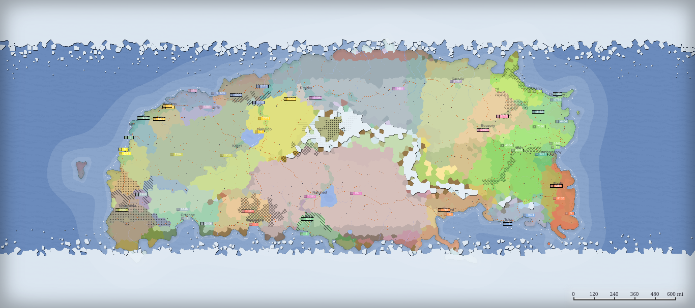

# Literal Storyboard



## About Our Project

Literal Storyboard is an innovative game development tool created for the AWS Game Builder Hackathon. Our project combines AI storytelling with the Fantasy Map Generator to create immersive and dynamic gaming experiences. Every model call goes through [OpenRouter](https://openrouter.ai), so the story, the grader and the scene painter can each be swapped for any model on the platform without touching game code.

## Key features

- **AI Storytelling**: A fresh story beat, question and set of replies for every city you land on.
- **Generated Scenery**: Each beat's background is painted on the fly and fades in behind the text.
- **Sentiment as a Game Mechanic**: The AI grades the *tone* of the reply you pick. Kind answers win allies, cruel ones make enemies — lead by 3 to win, fall behind by 3 and Eldoria turns away.
- **Snake-and-Ladder Style Board**: Roll the dice and watch your party walk the route city by city across a generated fantasy map.
- **Playable Without a Key**: No API key configured? The game falls back to bundled stories and artwork instead of erroring out.

## How to Use

1. Clone the repository:
    ```bash
    git clone https://github.com/thirza258/literal-storyboard.git
    cd literal-storyboard
    ```

2. Install the dependencies:
    ```bash
    npm install
    ```

3. Add an OpenRouter API key (optional — see above):
    ```bash
    cp .env.example .env
    # then edit .env and paste a key from https://openrouter.ai/keys
    ```

4. Run the development server:
    ```bash
    npm run dev
    ```

Open `http://localhost:5173` to play.

> **Note on the API key.** `VITE_*` variables are inlined into the client bundle, so the key ships to every player's browser. That is fine for a local run or a hackathon demo; put the OpenRouter calls behind a backend function before deploying anything public, and set a spend limit on the key either way — image generation costs materially more per call than text.

## Running with Docker

```bash
docker compose up app            # production build served by nginx -> http://localhost:8080
docker compose --profile dev up  # vite dev server with hot reload  -> http://localhost:5173
```

The key is read from `.env`. Because Vite inlines `VITE_*` variables at build time, changing the key means rebuilding the production image (`docker compose build app`) — and it also means **the key is baked into any image you publish**.

## Deploying

`./deploy.sh` wraps the whole path — install, typecheck, lint, build, then ship:

```bash
./deploy.sh build           # verify and build into dist/
./deploy.sh docker          # build the container image
./deploy.sh docker --push   # ...and push to $IMAGE_REGISTRY
./deploy.sh amplify         # deploy the Amplify backend, then build
./deploy.sh help
```

Anything that leaves the machine prompts first; pass `--yes` in CI.

### A note on `package-lock.json`

Amplify's build runs `npm ci`, which refuses to install when the lock file and `package.json` disagree. Two things keep that working:

- The `overrides` entry pinning `@opentelemetry/core`. The Amplify CDK constructs reach it through bundled transitive deps that pin an exact `2.0.0`, which npm resolves to `2.8.0`/`2.10.0` and then reports as missing. Collapsing it to one version is what makes the lock file valid. Re-check with `npm ci --dry-run` before removing it.
- Regenerating the lock file from scratch (`rm -rf node_modules package-lock.json && npm install`) produces a lock that `npm ci` **rejects** on the first pass. Running `npm install` a second time converges it. Always confirm with `npm ci --dry-run` before pushing a regenerated lock file.

## Technology Stack

- React 19 + TypeScript
- Vite 8
- Tailwind CSS 4
- OpenRouter (`/api/v1/chat/completions` and `/api/v1/images`, called with `fetch` — no SDK)
- `google/gemini-3.7-flash` — story and sentiment grading, via JSON-schema structured outputs
- `google/gemini-3.1-flash-lite-image` — scene backgrounds
- AWS Amplify
- Fantasy Map Generator

Model slugs live in a single file, [`src/ai_handler/models.ts`](./src/ai_handler/models.ts). Point them at `openai/gpt-5.4-mini`, `anthropic/claude-haiku-4.5`, `black-forest-labs/flux.2-pro` or anything else on OpenRouter — a one-line change. Two things to check when you do:

- the text model must advertise `structured_outputs` in [`/api/v1/models`](https://openrouter.ai/api/v1/models);
- `aspect_ratio` and `resolution` are per-model enums, listed in [`/api/v1/images/models`](https://openrouter.ai/api/v1/images/models).

## Map Generation

Our project integrates with the Fantasy Map Generator to create rich, detailed worlds for your gaming adventures. Cities are laid out along a winding route across the map, and their positions are stored as fractions of the map so the board survives a window resize untouched.

## Get Involved

We're excited to be part of the AWS Game Builder community and look forward to collaborating with other developers. Whether you're a game developer, storyteller, or enthusiast, we welcome your contributions and feedback to make Literal Storyboard even better.

Special thanks to:

- AWS Amplify for providing the platform to host our project.
- OpenRouter for routing every story and scene request to the model of our choice.
- Nano Banana for painting the scenes and characters.
- Fantasy Map Generator for providing the map generation capabilities.
- Amazon Q and Copilot for their assistance in developing the project.

Join us on this exciting journey and let's create something extraordinary together!
